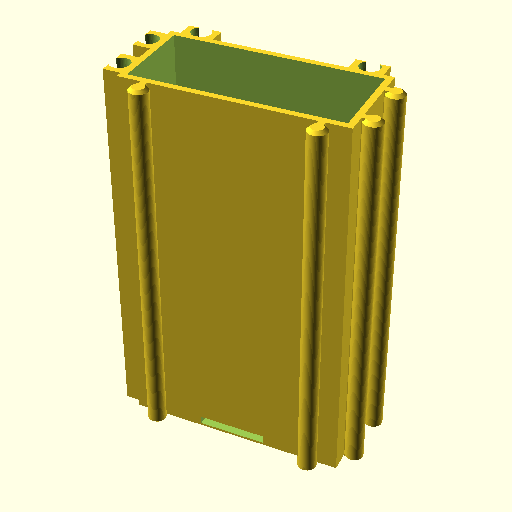
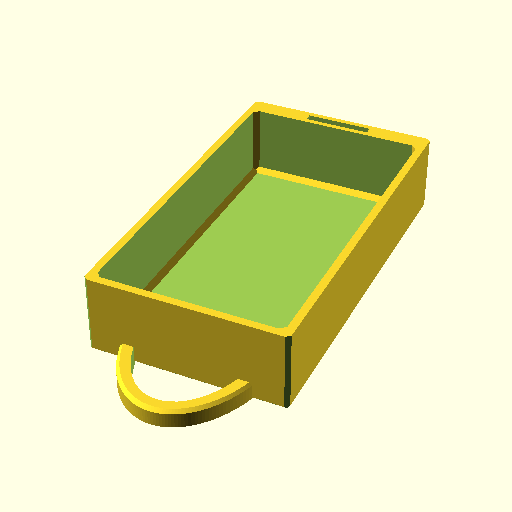

# Mini Drawers Ultimate

This repository contains OpenSCAD files from [Mini Drawers Ultimate](https://www.thingiverse.com/thing:1889761).




`1x1` is great for through-hole transistors, 8 pin DIP ICs. `2x1` is just
enough size for through-hole resistors, diodes, and 28 pin DIP ICs.

## Rationale

Thingiverse does not encourage designers to share original code or files.
Often, designers uploads STL files only. Some, including the author of the
original design, upload original files so that others can re-mix the original,
fix bugs, adopt the design. However, it is really difficult to track changes,
report bugs, etc. I tried to rebuild STL files without success. The code uses
an external library, but the author did not include the library, nor mention
the version.  The code should be managed in Version Management System.

## Requirements

- openscad
- BSD make (optional, not GNU make)
- X server (optional)

## Usage

```console
git clone https://github.com/trombik/Mini-Drawers-Ultimate.git
cd Mini-Drawers-Ultimate
env OPENSCADPATH=src/lib/Chamfers-for-OpenSCAD openscad src/drawer.scad
env OPENSCADPATH=src/lib/Chamfers-for-OpenSCAD openscad src/house.scad
```

Or simply:

```console
make
```

If you want 2x1 version, then:

```console
make XY_FLAGS="-D num_x=2 -D num_y=1"
```

The command above creates `house.stl`, `house.png`, `drawer.stl`, and
`drawer.png`. As `OpenSCAD` cannot export images without X screen, X server is
required.

## Defaults

- Drawer and house have drop-in magnet holes. Removing them does not save much
  space.
- No slot partition. It does not make sense because 1) the partitioned space
  is too small for anything, 2) it would be hard to find parts when one drawer
  has multiple parts.
- Magnet hole is 10 mm diameter and 0.8 mm thickness, which is commonly
  available.
- One handle per drawer

If the defaults do not work for you, `make` variables can be overridden. Or,
do not use the `Makefile`.

## STL files

The [Releases](../../releases) page has STL files of the pair in various sizes.

## Tips

The drawer is very easy to print. The house is more difficult. PLA works fine.

Use magnets. They are cheap, and you will appreciate them.

When the runner of house is not printed well, try 0% infill. The infill often
creates nonuniform shape. Even without infill, the strength is just enough.

Bad shaped runner can be fixed by a small electric drill and carving bits.

Be sure to avoid stringing. Stringing produces bad prints. See [Cura
Retraction Settings: How to Avoid Stringing](https://all3dp.com/2/cura-retraction-settings-how-to-avoid-stringing/).

In addition to custom retraction settings, disabling combing in Travel setting
produces better results. See [Travel settings](https://support.ultimaker.com/hc/en-us/articles/360012611299-Travel-settings).

Layer hight should be 0.2 mm. 0.1 mm layer hight produces better prints, but
unacceptably long to print. For example, 2x2 house takes 7 hours with 0.1 mm,
3.5 hours with 0.2 mm.

## Authors

- [Trevor Moseley](https://www.thingiverse.com/trevm/designs) (all the work)
- [Tomoyuki Sakurai](https://github.com/trombik) (repository maintenance and
  CI)

## License

[Attribution 4.0 International (CC BY 4.0)](https://creativecommons.org/licenses/by/4.0/).
See [LICENSE](LICENSE) for details.
